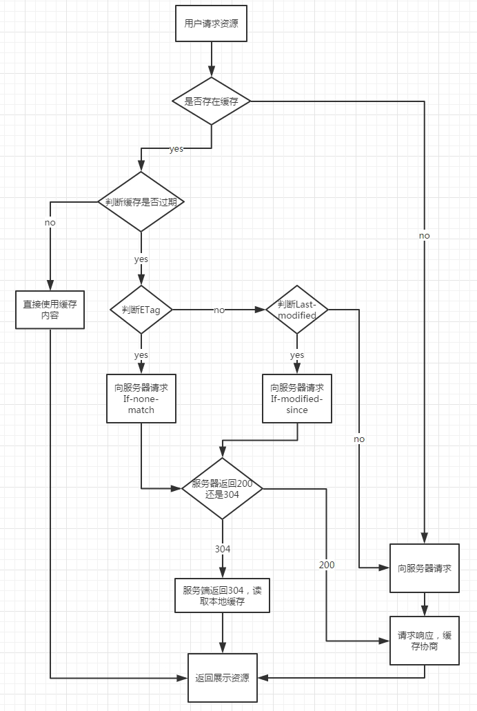

### 缓存
> 强缓存(Expires和Cache-Control)、协商缓存(Last-Modified / If-Modified-Since和Etag / If-None-Match)

浏览器发起HTTP请求到服务器，先检查强缓存

### 协商缓存(Last-Modified / If-Modified-Since和Etag / If-None-Match)

> Etag 优先级高于 Last-Modified，Last-Modified精确颗粒度只能精确到秒

1. Last-Modified / If-Modified-Since 过程

客户端在request header携带上If-Modified-Since(上次请求资源返回的Last-Modified)在客户端询问文件是否有更新，yes，返回资源， no, 返回304

2. Etag / If-None-Match

客户端在request header携带上If-None-Match(上次请求资源返回的Etag)，询问服务端该资源是否有更新，yes，返回资源， no, 返回304

### 缓存流程

1. 客户端加载资源前，先根据请求头的expires和cache-control 判断是否命中强缓存? yes, 从缓存(from memory cache 内存缓存 或者 from disk cache)中读取缓存， no，发送请求

2. 服务器通过last-modified和etag验证资源是否命中协商缓存？ yes, 返回304，从本地缓存读取资源， no, 返回资源数据

3. 强缓存和协商缓存都没命中， 直接从服务器加载资源

