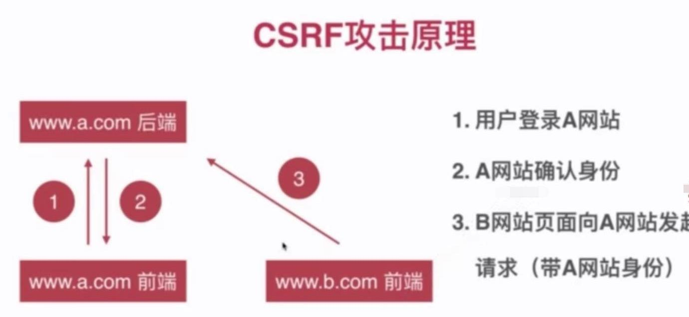
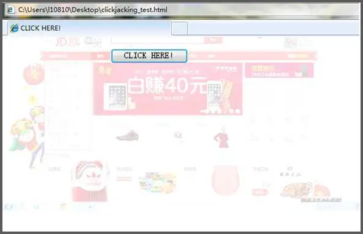
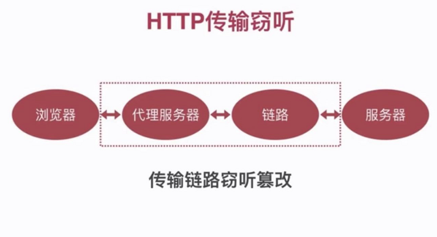
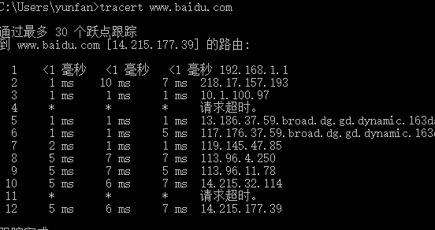
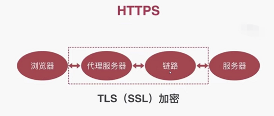
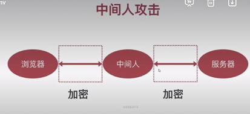

### XSS(跨站脚本攻击)
> 通过在网页html、html属性中注入恶意代码，执行代码偷取用户cookie，隐私信息等

+ #### 分类
  
  1. 反射型： 在访问链接通过参数带上恶意代码，页面取出参数恶意代码注入到html被执行

  2. 存储型： 通过将攻击代码存入服务器，下次渲染页面从服务器取出注入到页面执行

+ #### 注入点
  
  1. html内容、 html属性、 JavaScript代码

+ #### 案例

  1. html属性
  ```html   
  
  ```  

+ #### 防范 
1. 对用户页面输入的内容进行处理
+ 白名单控制允许的 HTML 标签及各标签的属性
+ 编码 对<、 >、 "、'、空格、换行等进行字符实体编码
+ 转义script、link、iframe、frame等标签<>以及过滤部分标签属性(img onerror等属性) 

[js xss 转码库](https://github.com/leizongmin/js-xss)


cookie安全
1. 重要cookie设置HttpOnly，阻止恶意代码读取 
2. 对来源于用户的内容做xss过滤

[如何防止XSS攻击？](https://juejin.im/post/5bad9140e51d450e935c6d64)

#### CSRF
> 用户打开黑客的B网站，向用户的A网站发送请求，携带用户的Cookie(登录态)获得服务器信息，从而盗取信息，转账，操作网页等


 

+ #### 案例
用户登录A银行网站，打开黑客发送的B网站页面，B页面写有请求A转账的脚本（在用户不知情的情况下执行）， 转走用户的金额（A网站的未做crsf防御）

+ #### 防范 
1. 界面加入验证码
2. Referer Check
    根据 HTTP 协议，在 HTTP 头中有一个字段叫 Referer，它记录了该 HTTP 请求的来源地址。通过 Referer Check，可以检查请求是否来自合法的"源"。
3. Token 验证
   例如： PHP Laravel框架VerifyCSRFToken中间件生成X-XSRF-TOKEN验证是否跨站请求

[浅谈CSRF攻击方式](https://www.cnblogs.com/hyddd/archive/2009/04/09/1432744.html) 

[浅说XSS和CSRF](https://github.com/dwqs/blog/issues/68)


### 点击劫持
> 使用iframe嵌入目标网页(用户已登录网页)，使用透明度0隐藏iframe，覆盖一张欺骗用户的图诱导用户(用户不值钱)点击，从而触发目标网页的操作



+ 案例：在一个flash上面覆盖诱导性信息，当用户不知情点击时操作flash打开摄像头

+ 防御(禁止网页嵌入iframe)
1. js判断 (禁用js无效)
```js
if (top.location != window.location) {
    //判断上层window对象不等于的当前的location时，将外层网址直接跳转到当前网页
    top.location = window.location;
} 
```

2. X-FRAME-OPTIONS使用禁止目标站点在iframe加载
```js
//koa 设置页面响应头
// DENY // 拒绝任何域加载
// SAMEORIGIN // 允许同源域下加载
// ALLOW-FROM // 可以定义允许frame加载的页面地址
ctx.set("X-FRAME-OPTIONS", "DENY");

```


### HTTP 传输窃听
> http协议(明文传输)传输过程中，被链路中间路由器、网关、代理服务器等中间节点设备窃听或篡改数据



traceroute domain (mac) 或者 tracert domain (window) 查看域名经过的链路



+ #### HTTP 篡改

+ 植入广告（运营商或连接wifi访问到对应的广告页面）
+ 重定向到非法网站
+ 无法防御的XSS和CSRF攻击

+ #### 案例 

1. 运营商篡改

2. 连接免费wifi盗取网页信息

+ #### 防范
使用HTTPS传输


### HTTPS 与 HTTP 的区别
 
HTTPS 基于SSL协议之上的HTTP，在传输之前会经过SSL加密，SSL依靠证书(一般是CA)来验证服务器的身份，并为浏览器和服务器之间的通信加密。
 
1、http是超文本传输协议，信息是明文传输，https则是具有安全性的ssl加密传输协议。

2、http和https使用的是完全不同的连接方式，用的端口也不一样，前者是80，后者是443。

3、http的连接很简单，是无状态的；HTTPS协议是由SSL+HTTP协议构建的可进行加密传输、身份认证的网络协议，比http协议安全。

### 中间人攻击
攻击者劫持链路，使用伪造证书和服务器及浏览器建立连接，篡改数据，钓鱼




防范措施：
不要随意连入公共场合内的WiFi，或者使用未知代理服务器
不要安装不可信或突然出现的描述文件，信任伪造的证书；
App内部需对服务器证书进行单独的对比校验，确认证书不是伪造的；


### Cookie安全

+ md5加密(二次变换，防止彩虹表撞库)加盐(签名)
+ http-only(防止XSS)
+ secure(较少使用)(http协议无法发送给服务器，只能https协议下带上该属性的cookie发送给服务器，比较少用，只兼容chrome和firefox浏览器)
+ SameSite(较少使用) 允许服务器设定一则 cookie 不随着跨域请求一起发送，这样可以在一定程度上防范跨站请求伪造攻击

### SQL 注入
