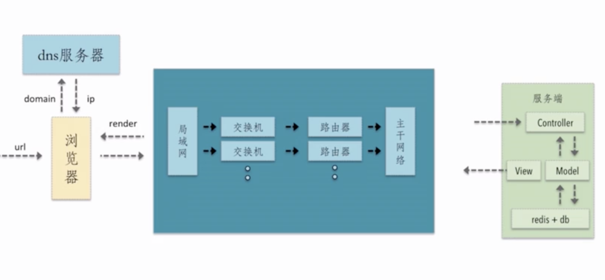
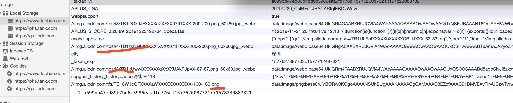
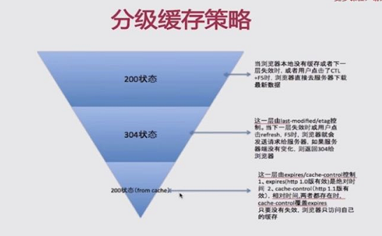

## 性能优化层面
1. 网络层面
2. 构建层面
3. 服务端层面
4. 浏览器渲染层面    

## 网络层面
## <p style="color: red">从输入url 到 浏览器显示页面步骤：</p>


1. dns 解析(从浏览器dns缓存，系统hosts文件，本地dns服务器，运营商dns服务器，顶级域名服务器查找对应的IP地址)获得服务器ip

2. 经历TCP三次握手(1.浏览器发包确认服务器是否能接收数据  2.服务器接受到数据发送给浏览器，确认浏览器能否接收数据  3.浏览器发送数据告诉服务器能够接收数据，可以开始发送数据)与服务器建立连接

3. 浏览器发送HTTP请求

4. 服务器响应浏览器请求的内容

5. 浏览器获取到请求的内容，开始执行渲染

   5.1. 处理HTML标记并构建dom树

   5.2. 处理css标记并构建css渲染树

   5.3. 将dom树和css渲染树合成渲染树，在页面绘制出来

#### dns 缓存优化
1. dns 预解析(通过dns-prefetch告诉浏览器做dns预解析)

```html
<link rel="dns-prefetch" href="https://www.baidu.com" />

```
2. 域名发散
利用PC端浏览器最多向同一个域名发送 6 个请求，将 http 静态资源放入多个域名/子域名中

3. 域名收敛
将静态资源放在同一个域名下，减少 DNS 解析的开销

#### http 请求优化相关
1. 合并js css 文件，减少http请求， 压缩文件大小，减小http请求时间消耗

2. image 雪碧图 减少http请求、 使用base64内嵌图片到html(image inline 减少http请求，多用于小图标)、 svg小图标(色彩不丰富)

图片的分类: JPG 不透明图片场景
          PNG  透明图片场景
          webp 安卓场景
          svg 矢量图 简单图片场景

3. 图片懒加载、图片预加载


## 浏览器渲染方面

1. 重绘与回流

回流： 元素因为几何尺寸、位置、显隐发生改成而导致重现构建该部分渲染tree

重绘：元素因为外观、风格改变导致浏览器重新绘制不影响渲染tree的重新构建

优化： 1.1、 频繁回流操作尽量在一个图层中操作，对最外层元素使用display隐藏，操作完再显示
    1.2、 尽量使用重绘的css属性代替回流的属性，translate替代top、opacity替代visibility
    1.3、 使用预设的class批量修改css样式
    1.4、 避免使用table布局(table改动会造成回流)
    1.5、 合理开启GPU加速，使用transform:translateZ(0)或者will-change:transform开启浏览器GPU加速


## 服务端层面 

Cookie、 LocalStorage、 SessionStorage

1. Cookie 是改善Http无状态协议的，存储量小，仅有几k大小

2. LocalStorage 用于浏览器本地存储，存储量大，有几M大小

3. SessionStorage 浏览器会话级别存储(页面被关闭)，使用场景少，例如表单填写信息，页面刷新数据保存使用

性能优化： 
1. Cookie 只使用用户登录信息相关存储，减少http传输数据损耗(http(静态资源、xhr)请求会携带该主域下面的cookie信息)，例如百度静态文件采用非当前主域cdn请求，避免带宽浪费，

2. LocalStorage 存储不经常变更图片、js、css，不用走互联网带宽请求，节省带宽



结合实操案例：网通电商的静态资源走非主域的cdn域名，节省因为请求资源携带cookie浪费带宽
云帆某站将echart等不变更js库存储在LocalStorage下面，节省每次请求的带宽和请求时间，提升了速度

ssr 前端页面直出优化(seo和首屏加载)

## HTTP缓存优化
> 缓存机制分为浏览器强缓存(cache-control 、 expire) 与 协商缓存

### 强缓存(cache-control: max-age / expire 命中缓存不向服务器发送请求)
> 服务端通过http response header头告诉文件怎样把文件缓存下来
<strong>Cache-Control</strong>


1. cache-control: max-age=xxxx 
服务端客户端在xxx秒的有效期内，如果有请求该资源的需求的话就直接读取缓存,statu code:200 ，如果用户做了刷新操作，就向服务器发起http请求

2. cache-control: max-age=xxxx，public 
public 告诉客户端和代理服务器（cdn）都可以缓存该资源

3. cache-control: max-age=xxxx，private
private 只让客户端可以缓存该资源；代理服务器不缓存

4. cache-control: max-age=xxxx，immutable
immutable 客户端在xxx秒的有效期内，如果有请求该资源的需求的话就直接读取缓存,statu code:200 ，即使用户做了刷新操作，也不向服务器发起http请求

5. no-cache 跳过强缓存，直接请求服务器，但是会走协商缓存

6. no-store 跳过强缓存，协商缓存。即不存在缓存

<strong>Expire</strong>

优先级低于Cache-Control 设置一个过期时间，比对客户端时间，假如客户端时区与服务端不一致，容易造成缓存失效问题

### 协商缓存(Last-Modified / If-Modified-Since和Etag / If-None-Match 先向服务器发送请求再确定是否命中缓存)

> Etag 优先级高于 Last-Modified，Last-Modified精确颗粒度只能精确到秒

1. Last-Modified / If-Modified-Since 过程

客户端在request header携带上If-Modified-Since(上次请求资源返回的Last-Modified)在客户端询问文件是否有更新，yes，返回资源， no, 返回304

2. Etag / If-None-Match

客户端在request header携带上If-None-Match(上次请求资源返回的Etag)，询问服务端该资源是否有更新，yes，返回资源， no, 返回304

### 缓存流程

三级缓存



缓存流程


1. 客户端加载资源前，先根据请求头的expires和cache-control 判断是否命中强缓存? yes, 从缓存(from memory cache 内存缓存 或者 from disk cache)中读取缓存， no，发送请求

2. 服务器通过last-modified和etag验证资源是否命中协商缓存？ yes, 返回304，从本地缓存读取资源， no, 返回资源数据

3. 强缓存和协商缓存都没命中， 直接从服务器加载资源


[强缓存与协商缓存](https://github.com/amandakelake/blog/issues/41)


### 用户操作对缓存的改变
1. 刷新(点击刷新按钮或者按F5，会触发这种行为)
    浏览器直接对本地的缓存文件过期，但是会带上If-Modifed-Since，If-None-Match（如果上一次response带Last-Modified, Etag）这就意味着服务器会对文件检查新鲜度，返回结果可能是304，也有可能是200.

2. 强制刷新(用户按Ctrl+F5 )
    浏览器不仅会对本地文件过期，而且不会带上If-Modifed-Since，If-None-Match，相当于之前从来没有请求过，返回结果是200.

3. 地址栏回车
    浏览器发起请求，按照正常流程，本地检查是否过期，然后服务器检查新鲜度，最后返回内容。 


针对不常更新的静态文件，cache-control: max-age 可以设置长一点， cdn资源设置短一点  针对强缓存时间长的静态文件，需要更新可以更新hash后缀
针对不同文件的更新频率设置不同的  cache-control: max-age  甚至走协商缓存


Q：如何理解的前端性能优化？
前端性能优化体现在两个方面：1.让页面加载的更快。 2. 让页面使用的更流畅 
加载的更快，比如减少http请求数量，优化http请求时间，使用ssr降低白屏时间，
使用的更流畅，优化长列表加载展示性能、css使用尽量规避重排损耗性能、预加载、懒加载、避免闭包使用


Q：你在工作中做过的性能优化？
1. 优化过react定制化多选下拉组件，展示项数据过多加载性能，通过可视区伪装只展示需要看到的数据，用户下拉的时候替换上用户即将看到的内容
2. 以前在网通电商时，优化图片加载性能，将部分常用的图片存储在本地LS内，减少页面请求
3. 使用vue或react规避使用v-if或判断语句展示dom，降低重排造成的页面性能
4. 针对动画开启GPU加速 使用transform:translateY(0px)
5. 用户提交信息(防抖)&优化频繁搜索性能问题(节流)
