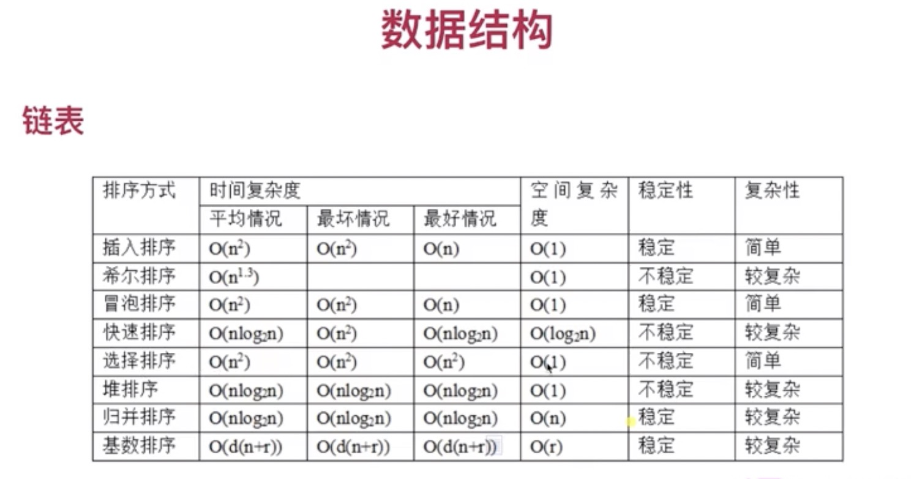

做算法题的时候不要一味追求优雅的写法，从动态规划建模算法，找出算法题的规律然后按规律做出来



### 时间复杂度
> 评估执行程序所需的时间。可以估算出程序对处理器的使用程度
```js
function a(n){
    for(let i = 0; i < n; i ++){
        //循环体运行n次  时间复杂度 O(n)
    }
} 
```


```js
function a(n){
    for(let i = 0; i < n; i ++){
        //循环体运行n次  时间复杂度 O(n)
    }
    for(let i = 0; i < n; i ++){
        for(let j = 0; j < n; j ++){
            //循环体运行n * n次  时间复杂度 O(n^2)
        }
    }
    // 顺序运算取最大的复杂度  max(O(n^2), O(n))  运行复杂度O(n^2)
} 
```


### 空间复杂度
> 评估执行程序所需的存储空间。可以估算出程序对计算机内存的使用程度。

[（数据结构）十分钟搞定时间复杂度（算法的时间复杂度）](https://www.jianshu.com/p/f4cca5ce055a)
[时间复杂度和空间复杂度的计算方法](https://blog.csdn.net/xzengwei1313/article/details/88797694)

### 冒泡排序（最大或最小的元素始终经过比对始终冒泡到最顶端）

> 1.每轮比对相邻的两个元素，交换其中最大的元素，每轮过后，该轮最大的元素始终会位于最右侧
2.重复1的步骤，上一轮最大的元素不纳入该轮比较
每次都比对元素，交换最大的元素

```js
const bubbleSort = arr => {
    // i是一个递减的过程
    for(let i = arr.length - 1, tem; i > 0; i --){
        // 对该轮进行遍历比较
        for(let j = 0; j < i; j ++){ 
            tem = arr[j] 
            if(tem > arr[j + 1]){ 
                arr[j] = arr[j + 1]
                arr[j + 1] = tem 
            }
        }
    }
    return  arr
}
```

### 选择排序
> 1.遍历数组，每次选出该项右侧最小一项，若最小一项小于该项则交换
2.依次遍历执行下去
每次只和最右侧最小元素变换
```js
const choiceSort = arr => {
    for(let i = 0, len = arr.length, tem; i < len; i ++){
        let min = arr[i]
        for(let j = i + 1; j < len; j ++){ 
            if(arr[j] < min){ 
                tem = arr[j]
                arr[j] = min 
                min = tem
            }
        }
        arr[i] = min
    }
    return arr
}
``` 

### 快速排序
> 
1、在数组中选择一个元素作为基准元素，将小于基准元素的放在左边，大于基准元素的放在右边
2、将两边的元素递归执行第一步

```js 
const quickSort = arr => {
    // 递归边界条件
    if(arr.length <= 1){ 
        return arr
    }
    let leftArr = []
    let rightArr = []
    // 任意选取一个基准元素
    let base = arr.splice(0, 1)[0] 
    arr.forEach((ele, i) => {
        // 将数组元素按基准元素大小分成两个数组
        ele > base ? rightArr.push(ele) : leftArr.push(ele)
    });
    // 递归排序
    return [...quickSort(leftArr), base, ...quickSort(rightArr)]
} 
```
### 递归
> 递归的本质：重复的操作和边界条件

### 数据结构
+ 栈
> 运算受限的线性表，先进后出.

+ 队列
> 运算受限的线性表，只允许在表的前端（front）进行删除操作，而在表的后端（rear）进行插入操作

+ 链表

+ 矩阵

+ 二叉树 

### 算法思想
+ 动态规划

+ 贪心算法